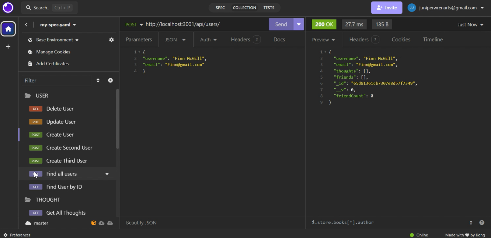

# Social Network API

## Description
This project is a backend for a social network web application where users can share their thoughts, react to friends' thoughts, and create a friend list. It uses MongoDB, a NoSQL database, to handle large amounts of unstructured data efficiently.



## Table of Contents
- [Installation](#installation)
- [Usage](#usage)
- [Features](#features)
- [Technologies Used](#technologies-used)
- [Demo](#demo)
- [Contributing](#contributing)
- [License](#license)

## Installation
To install the necessary dependencies, run the following command:
```bash
npm install
```

## Usage
To start the server, run:
```bash
npm start
```
Use Insomnia Core or a similar API testing tool to test the API routes.

## Features
- CRUD operations for users and thoughts.
- Ability to add and remove reactions to thoughts.
- Ability to add and remove friends from a user's friend list.

## Technologies Used
- MongoDB
- Mongoose ODM
- Express.js
- Node.js

## Demo
[Video Demonstration: Route Testing (run time 10:39)](https://drive.google.com/file/d/1iJbjlYohnyssZ068wvpaRbHCNzWFCJX7/view)

## Contributing and Questions
For any questions, please contact me at [JuniperWrenMcGill](https://github.com/JuniperWrenMcGill)

## License
This project is licensed under the [MIT License](LICENSE).